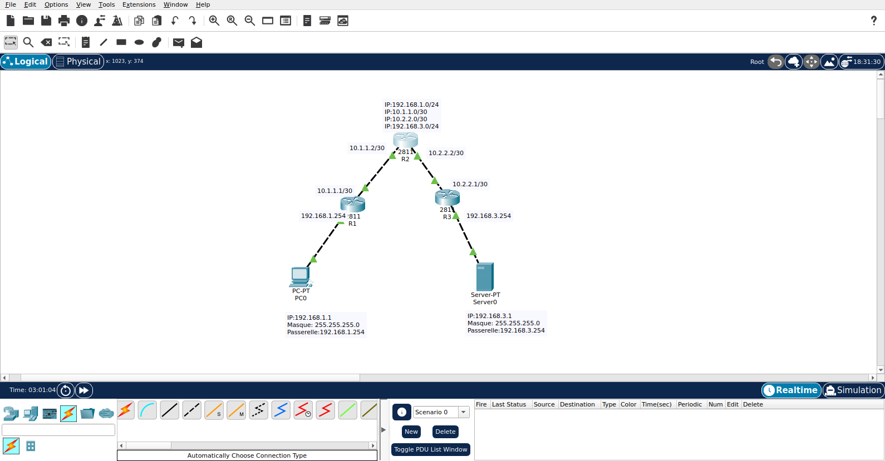
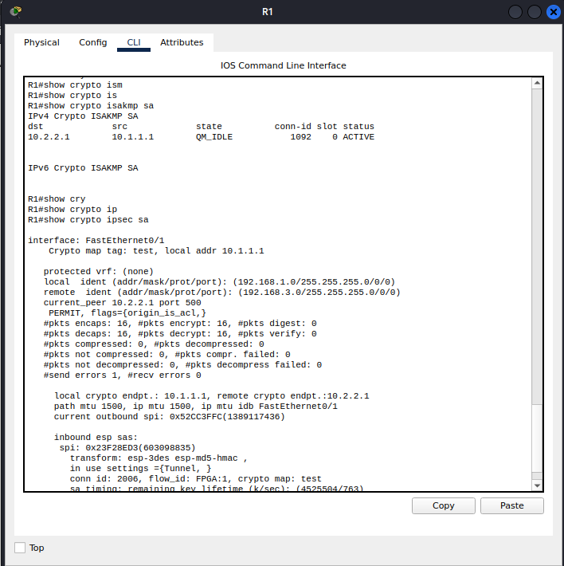
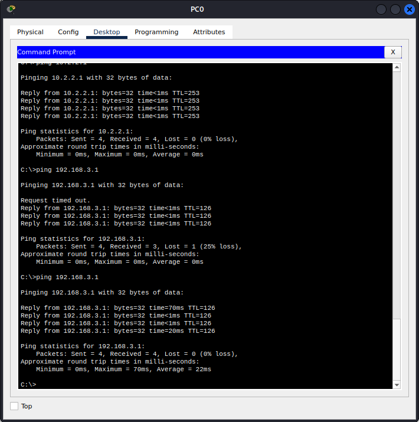

# Lab VPN IPSec Site-to-Site — Cisco Packet Tracer

> Configuration et debugging d'un tunnel VPN IPSec entre deux sites distants sur routeurs Cisco 2811.

---

##  Description

Ce lab simule la mise en place d'un **VPN IPSec Site-to-Site** pour sécuriser les communications entre deux réseaux LAN distants transitant par un réseau public. Le tunnel chiffre le trafic entre `192.168.1.0/24` et `192.168.3.0/24` en utilisant les protocoles **IKE (Phase 1)** et **IPSec ESP (Phase 2)**.

---

##  Topologie



| Équipement | Interface | Adresse IP       | Rôle                  |
|------------|-----------|------------------|-----------------------|
| PC0        | —         | 192.168.1.1/24   | Client LAN Site A     |
| R1         | fa0/0     | 192.168.1.254/24 | Gateway Site A (LAN)  |
| R1         | fa0/1     | 10.1.1.1/30      | WAN — endpoint tunnel |
| R2         | fa0/0     | 10.1.1.2/30      | Routeur de transit    |
| R2         | fa0/1     | 10.2.2.2/30      | Routeur de transit    |
| R3         | fa0/0     | 10.2.2.1/30      | WAN — endpoint tunnel |
| R3         | fa0/1     | 192.168.3.254/24 | Gateway Site B (LAN)  |
| Server0    | —         | 192.168.3.1/24   | Serveur LAN Site B    |

**Protocole de routage :** RIPv2 sur tous les routeurs.

---

## Configuration IPSec

### Phase 1 — ISAKMP (IKE)

| Paramètre       | Valeur         |
|-----------------|----------------|
| Authentification | Pre-shared key (`cisco`) |
| Chiffrement     | 3DES           |
| Hachage         | MD5            |
| Groupe DH       | 5              |
| Lifetime        | 3600 secondes  |

### Phase 2 — IPSec ESP

| Paramètre       | Valeur              |
|-----------------|---------------------|
| Transform-set   | `esp-3des esp-md5-hmac` |
| Mode            | Tunnel              |
| Lifetime SA     | 900 secondes        |
| Trafic protégé  | 192.168.1.0/24 ↔ 192.168.3.0/24 |

---

## Erreurs rencontrées & corrections

Trois erreurs ont été identifiées et corrigées durant le lab :

**Erreur 1 — Crypto map sur la mauvaise interface (R1)**
La crypto map était appliquée sur `fa0/0` (LAN) au lieu de `fa0/1` (WAN). Le chiffrement ne s'activait jamais car le trafic n'empruntait pas l'interface surveillée.
```bash
# Correction
no crypto map test          # retirer du LAN fa0/0
interface fastEthernet 0/1
 crypto map test            # appliquer sur le WAN
```

**Erreur 2 — set peer pointant vers le routeur intermédiaire (R3)**
Le crypto map de R3 avait `set peer 10.2.2.2` (R2) au lieu de `10.1.1.1` (R1). Les endpoints IPSec ne se correspondaient pas.
```bash
# Correction sur R3
crypto map test 10 ipsec-isakmp
 no set peer 10.2.2.2
 set peer 10.1.1.1
```

**Erreur 3 — Clé ISAKMP avec mauvais peer (R3)**
La clé pré-partagée sur R3 pointait aussi vers `10.2.2.2`, bloquant la Phase 1 en `MM_KEY_EXCH`.
```bash
# Correction sur R3
no crypto isakmp key cisco address 10.2.2.2
crypto isakmp key cisco address 10.1.1.1
```

---

## Résultats

### Tunnel IPSec établi — R1



```
QM_IDLE — ACTIVE
#pkts encaps: 9, #pkts encrypt: 9
#pkts decaps: 9, #pkts decrypt: 9
Status: ACTIVE
```

### Ping PC0 → Server0 (trafic chiffré)



```
Reply from 192.168.3.1 — 0% loss ✓
```

---

## Leçons apprises

- La **crypto map doit toujours être appliquée sur l'interface WAN** (celle qui fait face au réseau public), jamais sur le LAN.
- Le `set peer` et la clé ISAKMP doivent pointer vers **l'adresse WAN du routeur distant**, pas vers un routeur intermédiaire de transit.
- Les **ACL doivent être miroir** : source et destination sont inversées entre les deux extrémités du tunnel.
- Un tunnel IPSec ne s'active que lorsque du **trafic intéressant** (correspondant à l'ACL) traverse l'interface — un ping depuis le routeur lui-même ne suffit pas.

---

##  Outils utilisés


- **Cisco Packet Tracer** — Simulation réseau
- **Protocoles :** IKE, IPSec ESP, RIPv2
- **Algorithmes :** 3DES, MD5, Diffie-Hellman Group 5

---

##  Auteur

**Hodome Kokou Achille**
Administrateur Systèmes & Réseaux | Cybersécurité

Voici mon Linkdin: (www.linkedin.com/in/cyberachille)
